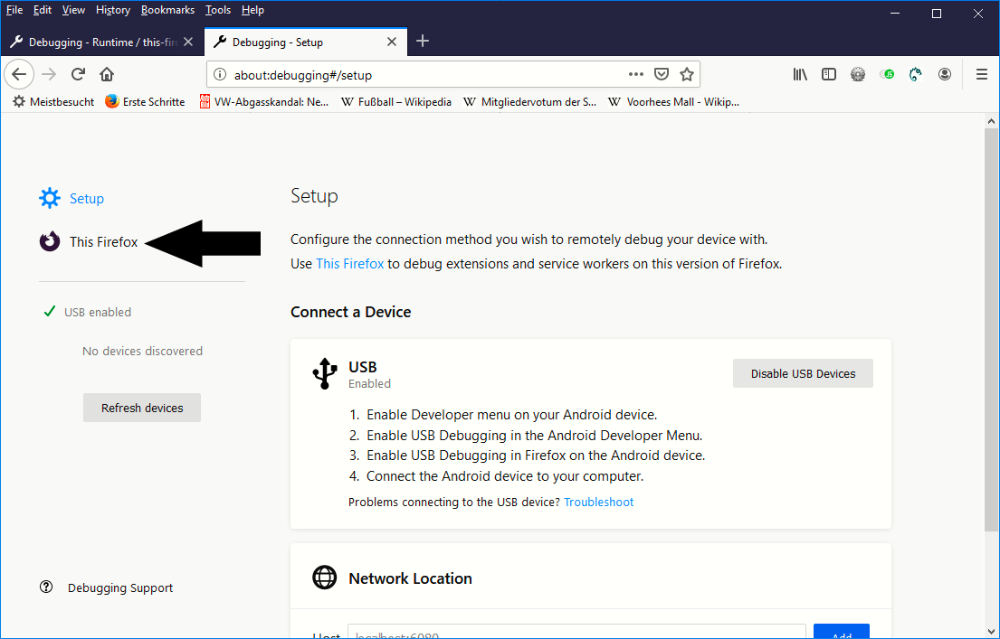
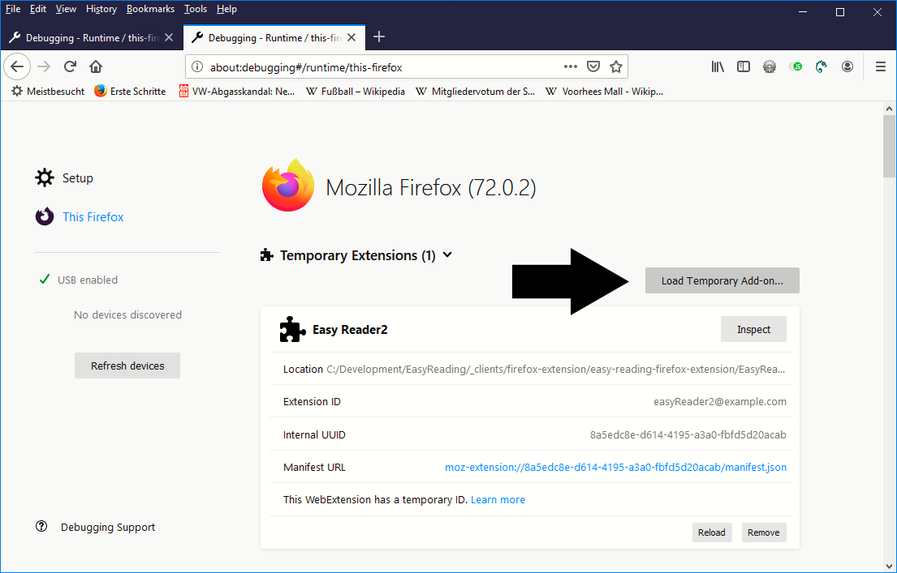
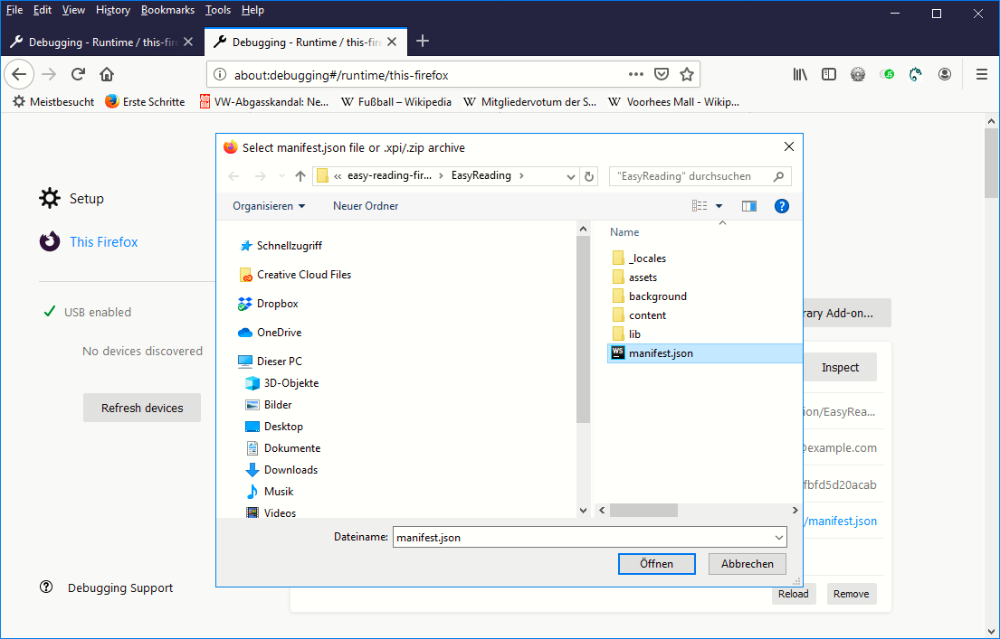
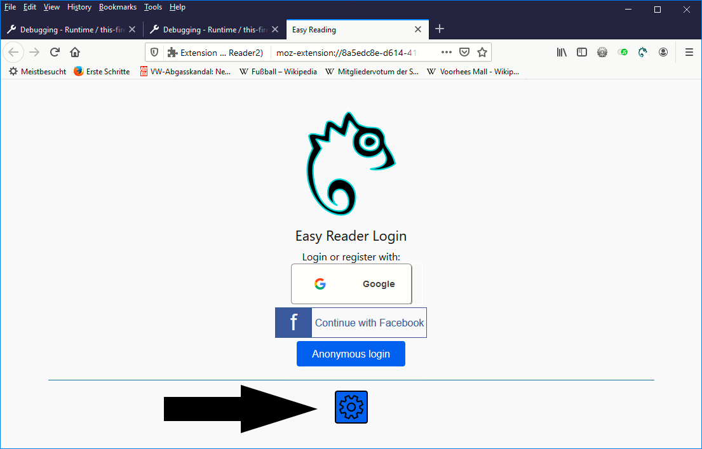

# Installation:

1. Clone or download and unzip the repository 
2. Open Firefox
3. Open the url: about:debugging.
4. Click on "This Firefox" in the left menu

5. Click on "Load temporary Add-on..."

6. Locate the manifest.json file in the EasyReading directory in the unzipped repository using the file dialog

7. The extension has been loaded successfully - click on of the login buttons to login, or on the cogwheel to change the cloud server. Latest features can always be found on the DEV-Server

